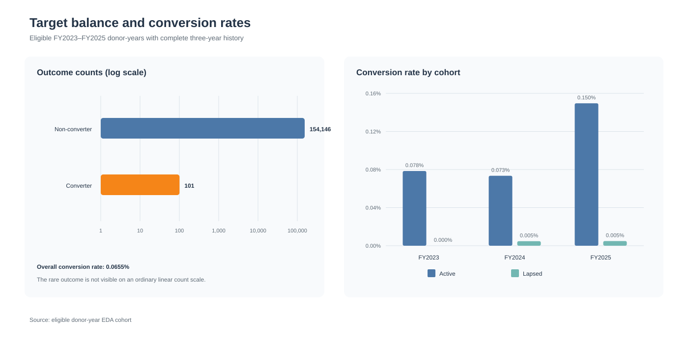
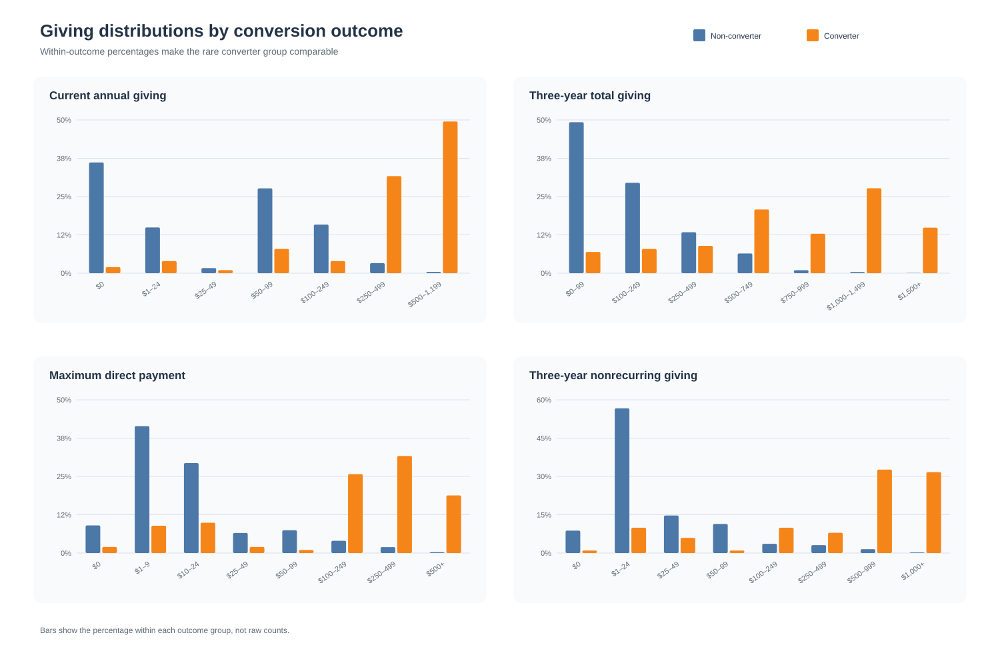
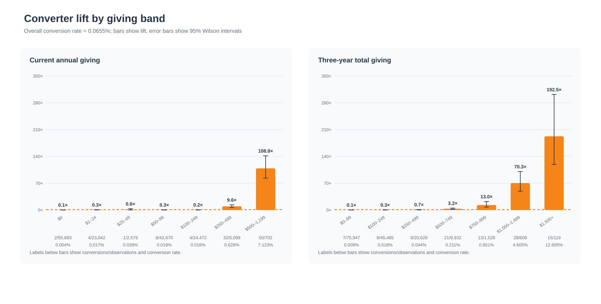
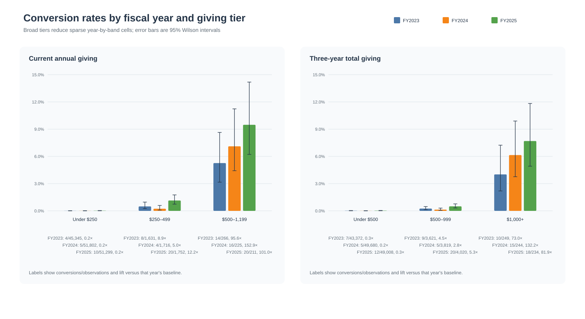
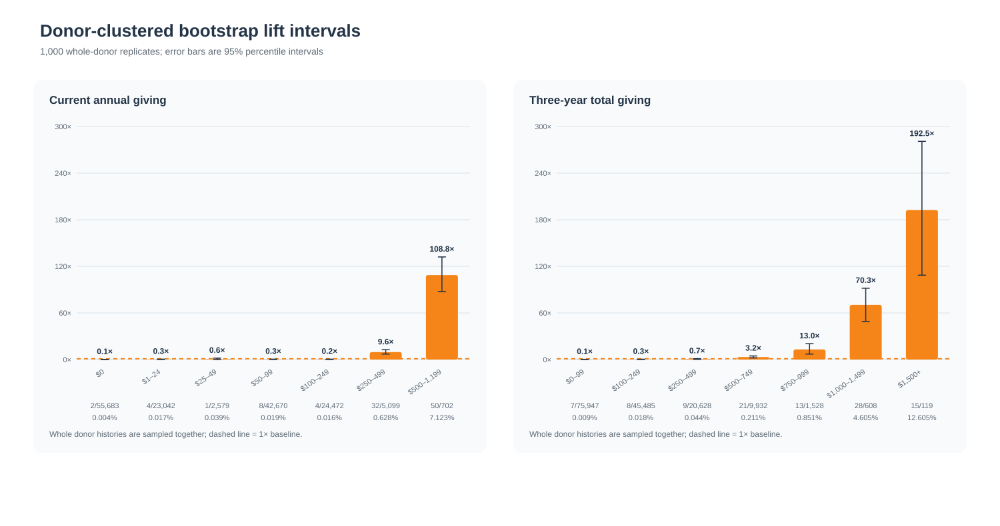

# Initial EDA visualizations

## Target balance

## Giving distributions

## Converter lift

Error bars are 95% Wilson intervals. Lift intervals divide the Wilson rate
interval by the overall cohort conversion rate; uncertainty in the baseline
rate is not propagated.

## Fiscal-year comparison

## Donor-clustered bootstrap intervals

These intervals resample complete donor histories so repeated donor-year
observations remain together.

The underlying lift values are available in
[`converter_lift_by_giving_band.csv`](converter_lift_by_giving_band.csv) and
[`converter_lift_by_fiscal_year.csv`](converter_lift_by_fiscal_year.csv).
Clustered-bootstrap intervals are available in
[`converter_lift_cluster_bootstrap.csv`](converter_lift_cluster_bootstrap.csv).
